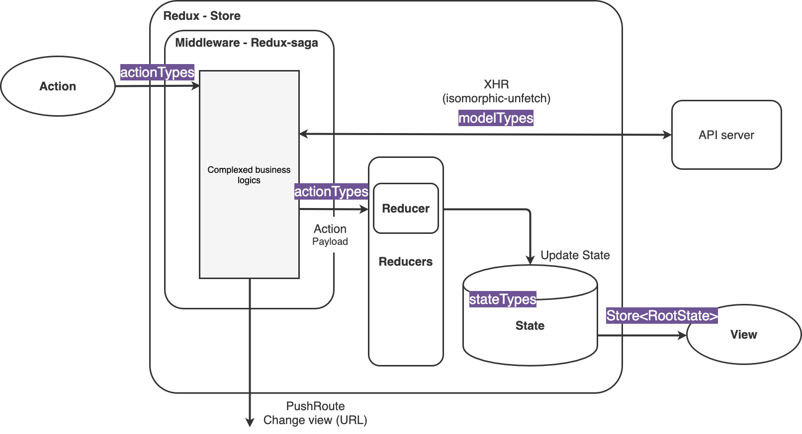

# Next.js with Typescript
[Next.js](https://nextjs.org/) simple boiler plate.

- [Motivation](#motivation)
  1. [Practical](#1-practical)
  2. [Simple](#2-simple)
  3. [Type annotation](#3-type-annotation)
- [Spec](#wpec)
- [Directory](#directory)
- [Environment](#environment)
- [How to use](#how-to-use)
- [Test policy](#test-policy)
  - [Component](#component)
  - [Redux / Redux-saga](#redux--redux-saga)
  - [Others](#others)


## Motivation
### 1. Practical
Most of Web FrontEnd App need a web server.  
This project deferred node.js (Koa.js) web server is prepared.

### 2. Simple
As mush as possible simple archtecture.  
It is clear what you are doing by looking at the code.

#### Flux
No business logic is brought into Action and Reducer.  
Business logic concentrates on Saga tasks.

##### Action
- Naming "actually happend"
    - As a result, REST-like naming
- No operation payload
- Action has two opreration
    1. Start any redux-saga task
    2. Deliver `Action` type and payload to reducer

##### Reducer
- Only do the work of updating which state for each `Action`
- No operation payload

##### Middleware (Redux-saga)
- Always start a task with an `Action`
- End the task with `Action`, or let the `routing process` finish the task
- Asynchronous processing uses the call API
- Can operation payload (※ keep the following promise)
    1. It is possible to take a value from `State` (using select API)
    2. It is also possible to manipulate the value retrieved from `State` in the task
    3. However, state must be updated via `Action => Reducer` (does not update `State` directly with the manipulated value)




### 3. Type annotation
- Use typescript

## Spec
- Application
    - Next.js
- HttpClient
    - [Isomorphic-unfetch](https://github.com/developit/unfetch/tree/master/packages/isomorphic-unfetch)
- Flux
    - [Redux](https://github.com/reduxjs/redux)
    - Middleware
        - [Redux-saga](https://github.com/redux-saga/redux-saga)
- Web server
    - [Koa.js](https://github.com/koajs/koa)
- Linter
    - [Eslint](https://github.com/eslint/eslint)
- Code format
    - [Prettier](https://github.com/prettier/prettier)
- Pre commit
    - [Husky](https://github.com/typicode/husky)
    - [Lint-staged](https://github.com/okonet/lint-staged)
- Language
    - [Typescript](https://www.typescriptlang.org/)
- Logging
    - [Bunyan](https://github.com/trentm/node-bunyan)
        - Web server logger
- Unit test
    - [Jest](https://github.com/facebook/jest)
        - [Testing-library](https://github.com/testing-library/react-testing-library)
            - Component testing
        - [Snapshot-diff](https://github.com/jest-community/snapshot-diff)
            - Reducer testing
        - [Redux-saga-test-plan](https://github.com/jfairbank/redux-saga-test-plan)
            - Saga task testing
- Code Generator
    - [Hygen](http://www.hygen.io/)
        - Generating code of basic component

## Directory
```
    .
    ├─ docker           # 
    │   ├─ app          # FrontEnd App (multi stage build)
    │   └─ web          # nginx (proxy)
    │
    ├─ pages            # web pages
    │   └─ api          # BFF api
    │
    ├─ server           # web server
    │
    └─ src              # 
        ├─ actions      # redux: action
        ├─ components   # react: component
        ├─ hooks        # react: hooks
        ├─ pages        # only next.js pages testing
        ├─ reducers     # redux: reducer
        ├─ sagas        # redux[middleware]: redux-saga
        ├─ service      # libs | utils
        └─ store        # redux: configure store
```
The testing directory is distributed in parallel with the directory that has each function.
```
    .
    ├─ hoge
    │   ├─ __test__ # hoge testing directory
```

## Environment
```
- node.js >= 12.14.1
- next.js >= 9.3.1
- docker
  - engine >= 19.03.x
  - compose >= 3.6
```

## How to use
### Quick development start
```
1. npm i install
2. docker-compose up

> http://localhost(:80)
```

This project use nginx for reverse proxy and static resource cache control.

```
   localhost:80      localhost:3000
    -----------     ----------------
--> |  nginx  | --> |     app      |
    | [proxy] |     | [next + koa] |
    -----------     ----------------
```

## Test policy
### Component
Mainly use [testing-library/react](https://github.com/testing-library/react-testing-library), [react-hooks](https://github.com/testing-library/react-hooks-testing-library).

#### Checkpoints
1. After fire event, compare target state or props differences
2. With or without props, examine the state of the output HTMLElement contained by Component

### Redux / Redux-saga
#### Action [priority: *LOW*]
Normaly **simple unit testing**.
Because of actions is pure function and have types for I/O,
If types is safe, there is without having to do little testing.

#### Reducer [priority: *MIDDLE*]
Reducer testing have two types, **unit** and **snapshot** testing.
Unit testing is compare initial state to updated state.
Snapshot testing is check the difference visually for target state.

##### Why do snapshot testing ?
The reducer updates the state (object) on the defined reducer scope for any action.  
In other words, it is necessary to check the change of state only for the variation of action, and it is not realistic to cover by comparing the values.  
Therefore, we propose to perform a regression test for any action.
If it is a regression, you can always check the state of the state visually with a pull request.  
If the specs change, the team will be able to discuss the changes in the PR.  
No need to consider values in regression tests. Just see what the reducer changes the state with the code.

#### Redux-saga [priority: *HIGH*]
Redux-saga testing is integration test using [redux-saga-test-plan](https://github.com/jfairbank/redux-saga-test-plan).  
If there is a unit test that can be separately performed during the task, let's do that as a separate test.  
Since the I/O of the task is guaranteed by the benefits of TypeScript, it is recommended that you evaluate whether the actual processing of the task is as intended.

### Others
Basically, do a unit test.
